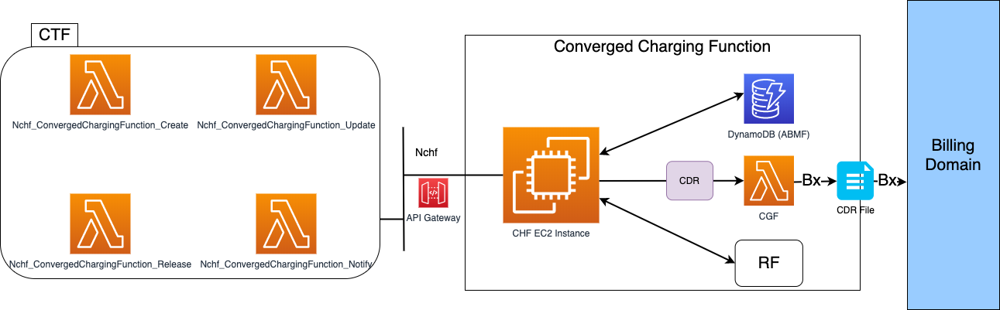

# Thesis
> Author: William Lin

* This github page is for my graduation thesis
* 2021/06

> On Branch: William


## Concepts
* Using Free5GC
* Set up serverless Online Charging Function with Lambda and API Gateway
* Store CDR into DynamoDB
* Use Milan Dataset

## Overview Architecture



## Set up

* [Lambda & API Gateway](https://github.com/williamlin0504/thesis/blob/main/Lambda%26APIGW.md)

* Clone the modified repository
```cli
$ git clone --recursive https://github.com/williamlin0504/free5gcWithOCF.git
```


## Set up previously
* [free5gc Test Modify](https://github.com/williamlin0504/thesis/blob/main/free5gc_Test_Modify.md)
* [free5gc YAML Deploy](https://github.com/williamlin0504/thesis/blob/main/Cloudformation_Yaml.md)