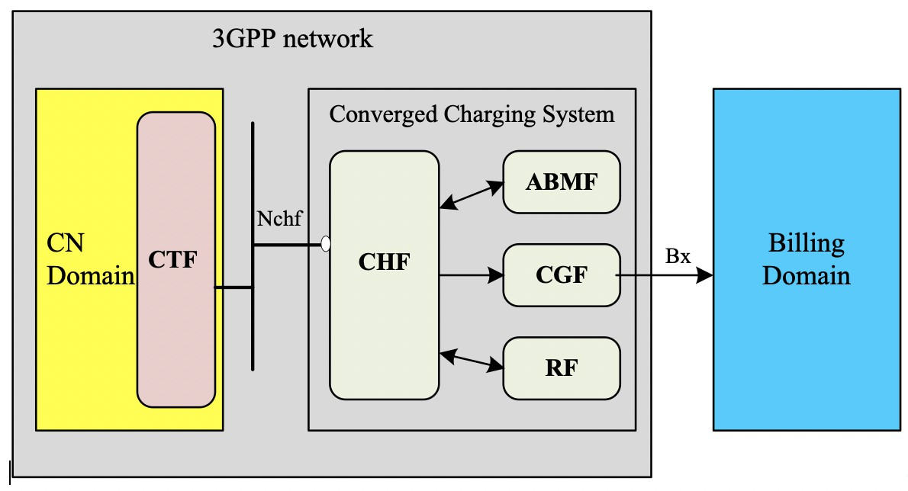

# Thesis
> Author: William Lin

* This github page is for my graduation thesis

> On Branch: William

## Concepts
* Using Free5GC
* Set up serverless Online Charging Function with Lambda and API Gateway
* Store CDR into DynamoDB
* Use Milan Dataset

## Works
* [Lambda & API Gateway](https://github.com/williamlin0504/thesis/blob/main/Lambda%26APIGW.md)
* [free5gc Test Modify](https://github.com/williamlin0504/thesis/blob/main/free5gc_Test_Modify.md)